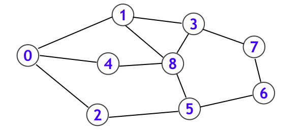
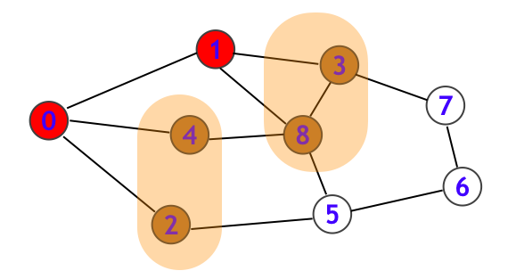
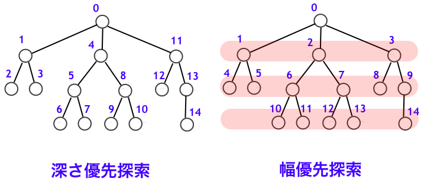
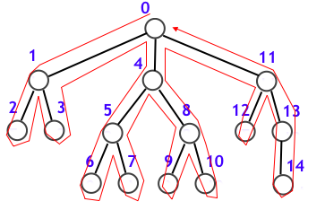
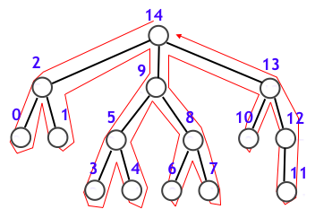
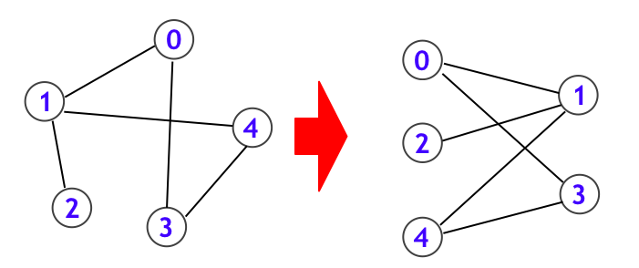
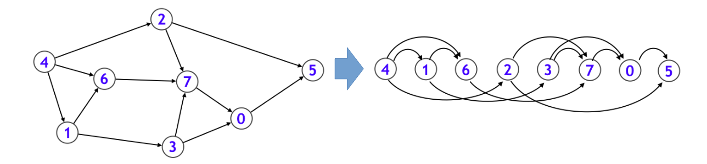
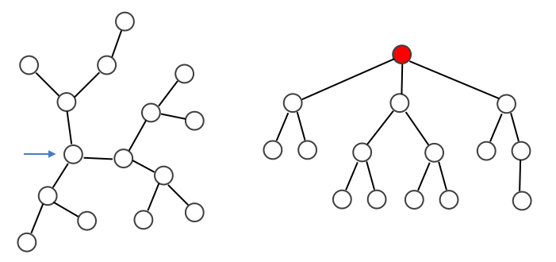
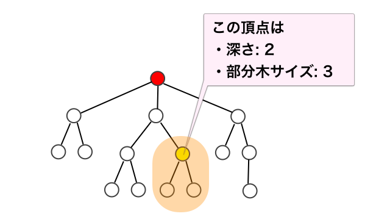

<!--
_color: white
_header: "**アルゴリズムとデータ構造輪講 2022** __技術チャレンジ部__"
_footer: 'Photo by https://www.pakutaso.com/<br>Author: Kenta Iwasa/[GitHub Repository](https://github.com/iwatadive28/ProgrammingContest/tree/main/JournalClub/13_Graph_search)'
-->
<!-- paginate: true -->


# アルゴリズムとデータ構造<br>13章 グラフ(1)：グラフ探索<!-- omit in toc -->

---


# 目次 <!-- omit in toc -->
- [なぜグラフ探索を学ぶのか？](#なぜグラフ探索を学ぶのか)
- [深さ優先探索と幅優先探索](#深さ優先探索と幅優先探索)
- [再帰関数を用いる深さ優先探索](#再帰関数を用いる深さ優先探索)
- [「行きがけ順」と「帰りがけ順」](#行きがけ順と帰りがけ順)
- [最短路アルゴリズムとしての幅優先探索](#最短路アルゴリズムとしての幅優先探索)
- [深さ優先探索と幅優先探索の計算量](#深さ優先探索と幅優先探索の計算量)
- [グラフ探索例(1)：s-tパスを求める](#グラフ探索例1s-tパスを求める)
- [グラフ探索例(2)：二部グラフ判定](#グラフ探索例2二部グラフ判定)
- [グラフ探索例(3)：トポロジカルソート](#グラフ探索例3トポロジカルソート)
- [グラフ探索例(4)：木上の動的計画法](#グラフ探索例4木上の動的計画法)
- [参考リンク](#参考リンク)
- [まとめ](#まとめ)

---
# なぜグラフ探索を学ぶのか？
グラフ探索技法を身に着けると、単にグラフに関する問題を解決できるようになるだけでなく、様々な対象物に対する探索を見通し良く扱えるようになります。

**一見グラフとは関係ないように思える問題も、グラフ上の探索問題としてとらえ直すことができます。** グラフ探索技法に習熟すると、

- ウォール、サイクル、パス
- 連結性

なども、自税に扱えるようになります。
    
---
# 深さ優先探索と幅優先探索

## グラフ探索手法の代表<!-- omit in toc -->

- 深さ優先探索（depth-first search：DFS）
- 幅優先探索（breadth-first search：BFS）

---

一例として、ネットサーフィンするときのことを思い浮かべる。下図のようなグラフはWeb ページのリンク関係を表す。グラフ探索の始点 s∈V は最初に開く Web ページであり、ここでは s=0 とする。


--- 
まず、 2 と 4 を保留にして 1 に対応するページを一通り読む(下図のように読了済のノードは赤く示す)。この次にどのページを読むのか？:

1. たった今読了した頂点 1 からそのまま辿れる頂点 (3 か 8) へと突き進む →**深さ優先探索**
2. 一旦、保留にしていた頂点 2, 4 に対応するページを読んでおく → **幅優先探索**



---

## グラフ探索で用いるデータ構造<!-- omit in toc -->

グラフ探索では2つのデータで管理する。

|変数名|データ型(C++) |説明| 
|-|-|-| 
|seen |vector<bool>         |その頂点を検知済みかどうかを表す配列。<br>`seen[v]=true`の場合、頂点vがtodoに挿入された瞬間があったことを表している。すでにtodoから取り出されている場合も含む。| 
|todo |stack<int><br>queue<int>|検知したがまだ訪問済みでない頂点の集合 (保留中の頂点の集合)。これから訪問する予定の頂点。| 

---

|色|状態|seen|todo|
|-|-|-|-|
|白|探索においてまだ見つかっていない状態。todoにも挿入されていない。|seen[v]=false|vはtodoに含まれない|
|橙|探索済みであるが、未訪問の状態|senn[v]=true|v∈todo|
|赤|訪問済みの状態|senn[v]=true|vはtodoに含まれない|

---
## グラフ探索の実装<!-- omit in toc -->

1. seen 全体を false に初期化して、todo を空にする
2. seen[s] = true として、todo に s を追加する 
3. todo が空になるまで以下を繰り返す:
    1. todo から一つ頂点を取り出してvとする
    2. G(v) の各要素xに対して、
        seen[x] = true であったならば、何もしない
        そうでなかったら、seen[x]=true として、todo にxを追加する

---
```c++
// グラフGにおいて、頂点sを始点とした探索を行う
void search(cnost Graph &G, int s){
    int N = (int)G.size(); // グラフの頂点数    
    // グラフ探索のためのデータ構造
    vector<bool> seen(N,false); // すべて未発見の状態
    queue<int>   todo;          // 空の状態(深さ優先探索では stack<int>)

    // 初期条件
    seen[s] = true; // sは探索済みとする
    todo.push(s);   // todoはsのみ含む状態とする

    while(!todo.empty()){ // todoが空になるまで探索を行う
        int v = todo.front(); // todoから頂点を取り出す
        todo.pop();

        for(int x:G[v]){  // vから辿れる頂点をすべて調べる
            if(seen[x]) continue; // すでに発見済みの頂点は探索しない
            seen[x] = true;       // 新たな頂点xを探索済み
            todo.push(x);         // todoに挿入
        }
    }
}
```
---

このコードは深さ優先探索？幅優先探索？

---

集合todo から頂点vを取り出す作業を行うときに、どのようなポリシーに従ってvを選ぶかによって、深さ優先探索か幅優先探索かの違いが生じる。

深さ優先探索：todoをスタックにすると、辿れる頂点を猪突猛進に探索する
幅優先探索：todoをキューにすると、todoに加えた頂点を順に一通り読んでから、より深いところへ進んでいく幅優先探索となる。
```c++
// グラフ探索のためのデータ構造
vector<bool> seen(N,false); // すべて未発見の状態
queue<int>   todo;          // 空の状態(深さ優先探索では stack<int>)
```
よって、上記コードは幅優先探索の例です。

---
## 木の場合の探索順<!-- omit in toc -->

木：「**サイクルを持たない**」かつ「**連結**」であるようなグラフ。DFSとBFSの探索する順番の違いが分かりやすい。



---
# 再帰関数を用いる深さ優先探索

ここまで、seenとtodoというデータを用いた実装について説明していた。
DFSは再帰関数と相性がよく、組み込み系でない限りは、しばしば再帰関数を用いて実装されます。

---
```c++
#define rep(i, n) for (ll i = 0; i < (ll)(n); ++i)
using Graph = vector<vector<int>>;

// 深さ優先探索
vector<bool> seen;
void dfs(const Graph &G, int v){
    seen[v] = true; // vを訪問済みとする
    for(auto next_v:G[v]){
        if(seen[next_v]) continue; // next_vが訪問済みならスルー
        dfs(G,next_v); // 再帰的に探索
    }
}
int main(){
    int N,M; // 頂点数:N,辺数:M
    cin >> N >> M;
    // グラフの入力受取（ここでは有向グラフ）
    Graph G(N);
    rep(i,M){
        int a,b;
        cin >> a >> b;
        G[a].push_back(b);
        // G[b].push_back(a); // 無向グラフの場合、逆も挿入
    }
    // 頂点0からスタートした探索
    seen.assign(N,false); // 初期状態では全頂点が未訪問
    dfs(G,0); 
}
```
---
# 「行きがけ順」と「帰りがけ順」

深さ優先探索の探索順序について考える。「トポロジカルソート」や「木上の動的計画法」を学ぶ時の理解の助けになる。
ここで、探索順序は
- 頂点vがtodoから取り出されるタイミング
- 再帰関数dfs(G,v)が呼び出されるタイミング

となる。

---
## 行きがけ順(pre-order)<!-- omit in toc -->
根から初めて訪問した頂点の順序で順位をつけたもの。
vの子孫となる頂点は、すべてvよりも後で登場する。

## 帰りがけ順(post-order)<!-- omit in toc -->
最後に訪問した頂点の順序で順位をつけたもの。
vの子孫となる頂点は、すべてvよりも前で登場する。




---
# 最短路アルゴリズムとしての幅優先探索
幅優先探索は、探索の始点となる頂点sから、各頂点への最短路を求めるアルゴリズムとも見なせる。データはseen, todo に対応するように、dist, queを用いる。

1. dist 全体を -1 に初期化して、que を空にする
2. dist[s] = 0 として、que に s を追加する 
3. que が空になるまで以下を繰り返す:
    1. que から一つ頂点を取り出して v とする
    2. G(v) の各要素xに対して、
        dist[x] != -1 であったならば、何もしない
        そうでなかったら、dist[x] = dist[v]+1 として、que にxを追加する

---
```c++
#define rep(i, n) for (ll i = 0; i < (ll)(n); ++i)
using Graph = vector<vector<int>>;

// 入力：グラフGと、探索の始点s
// 出力：sから各頂点への最短路長を表す配列
vector<int> BFS(const Graph &G, int s){
    int N = (int)G.size();  // 頂点数
    vector<int> dist(N,-1); // -1=未訪問に初期化
    queue<int> que;

    // 初期条件（頂点0を書記長店とする）
    dist[s] = 0;
    que.push(s); // 0を未訪問, queに加える

    // BFS開始（queが空になるまで探索を行う）
    while(!que.empty()){
        int v = que.front(); // queから先頭頂点を取り出す
        que.pop();

        // vから辿れる頂点をすべて調べる
        for(auto x:G[v]){
            if(dist[x] != -1) continue; // 発見済みの頂点は探索しない
            dist[x] = dist[v]+1; // 距離情報を更新
            que.push(x);         // queに挿入
        }
    }
    return dist;
}
```
---

```c++
int main(){
    int N,M; // 頂点数:N, 変数:M
    cin >> N >> M;

    // グラフ入力受取(無向グラフを想定)
    Graph G(N);
    rep(i,M){
        int a,b;
        cin >> a >> b;
        G[a].push_back(b);
        G[b].push_back(a);
    }

    // 頂点0を始点としたBFS
    vector<int> dist = BFS(G,0);
    
    // 結果出力(各頂点の頂点0からの距離を見る)
    rep(v,N) cout << v << ":" << dist[v] << endl;
}
```

---
# 深さ優先探索と幅優先探索の計算量
グラフ G=(V,E) として、頂点数 |V| 、変数 |E| の２つを入力サイズとする。
深さ優先探索も、幅優先探索も、

- すべての頂点が、高々1回ずつ探索される：O(|V|)
- すべての辺が、高々1回ずつ探索される：O(|E|)

つまり、計算量は **O(|V|+|E|)** となる。つまり、グラフを入力として受け取るのと同等の時間でグラフ探索も実施できる。

---
# グラフ探索例(1)：s-tパスを求める
有向グラフ G の二頂点 s,t∈V が与えられたとき、s から辺をたどって t に到達できるかどうかを判定する問題。

単純に、s を始点としたDFSを実施する。DFS実施後に seen 配列を見ることで、各頂点が探索されたかどうかを判定することができる。

---
```c++
#define rep(i, n) for (ll i = 0; i < (ll)(n); ++i)
using Graph = vector<vector<int>>;

// 深さ優先探索
vector<bool> seen;
void dfs(Graph &G,int v){
    seen[v] = true;
    for(auto next_v:G[v]){
        if(seen[next_v]) continue;
        dfs(G,next_v);
    }
}
int main(){
    int N,M,s,t; // 頂点数、辺数、スタート、ゴール
    cin >> N >> M >> s >> t;

    Graph G(N);
    rep(i,M){
        int a,b;
        cin >> a >> b;
        G[a].push_back(b);
    }
    // 頂点sをスタートとした探索
    seen.assign(N,false);
    dfs(G,s);
    cout << (seen[t]?"Yes":"No") << endl;
}

```
---
# グラフ探索例(2)：二部グラフ判定

二部グラフとは、「白色の頂点同士が隣接する(辺で結ばれる)ことなく、黒色の頂点同士が隣接することはない」という条件を満たすように、全頂点が白または黒に塗分けられるグラフ。


つまり、二部グラフとは図のように、グラフを左右のカテゴリに分割して、すべての辺は異なるカテゴリ間を結んでいる状態にできることを示す。

---
与えられた無向グラフが**二部グラフ**(bipartite graph) かどうかを判定する問題をDFSで解く(BFS や Union-Find 木で解くこともできる)。

まず、DFS の始点となる頂点 v については白黒いずれに塗ってもよい。そして、
- 白頂点に隣接した頂点は、黒でなければならない
- 黒頂点に隣接した頂点は、白でなければならない

のように、各頂点が何色でなければならないかが自動的に決まる。
この過程で「両頂点が同色であるような辺」が検出されれば、二部グラフでないことが確定する。

ここで、seen配列と同様に、色を表すcolor配列を下記のように用いる。
- color[v] = 0(白), 1(黒), -1(未訪問) 

---
```c++
#define rep(i, n) for (ll i = 0; i < (ll)(n); ++i)
using Graph = vector<vector<int>>;

// 二部グラフ判定(深さ優先探索)
vector<int> color;
bool dfs(Graph &G,int v, int cur = 0){
    color[v] = cur;
    for(auto next_v:G[v]){
        // 隣接頂点がすでに色確定していた場合
        if(color[next_v] != -1) { 
            if(color[next_v] == cur) return false; // 同じ色が隣接したらダメ
            continue;
        }
        // 隣接頂点の色を変えて、再帰的に探索 (一回でも false が返ってきたら false)
        if(!dfs(G,next_v,1-cur)) return false;
    }
    return true;
}
```
---
```c++
int main(){
    int N,M; // 頂点数、辺数
    cin >> N >> M;
    
    Graph G(N);
    rep(i,M){
        int a,b;
        cin >> a >> b;
        G[a].push_back(b);
        G[b].push_back(a); // 無向グラフ 
    }
    
    // 前頂点を始点として探索する
    color.assign(N,-1);
    bool is_bipartite = true;
    rep(v,N){
        if(color[v] != -1) continue; // vが探索済みならスルー
        if(!dfs(G,v)) is_bipartite = false;
    }
    cout << (is_bipartite?"Yes":"No") << endl;
}
```
---
## 二部グラフの類題<!-- omit in toc -->

- [AtCoder ABC 126 D - Even Relation](https://atcoder.jp/contests/abc126/tasks/abc126_d)　(二部グラフになるように白黒の塗り分けを行う問題です)
- [CODE FESTIVAL 2017 qualB C - 3 Steps](https://atcoder.jp/contests/code-festival-2017-qualb/tasks/code_festival_2017_qualb_c)　(よさげな問題です)

---
# グラフ探索例(3)：トポロジカルソート
**トポロジカルソート**とは、与えられたDAG(Directed Acyclic Graph=サイクルの無い有効グラフ)対し、各頂点を辺の向きに沿うように一列に並び変えること。



応用例として makefile などに見られるような、依存関係を解決する処理などは、まさにトポロジカルソートそのものである。

参考：[再帰関数を学ぶと、どんな世界が広がるか 4-3. DAG のトポロジカルソート](https://qiita.com/drken/items/23a4f604fa3f505dd5ad#4-3-dag-%E3%81%AE%E3%83%88%E3%83%9D%E3%83%AD%E3%82%B8%E3%82%AB%E3%83%AB%E3%82%BD%E3%83%BC%E3%83%88)

---

トポロジカルソート順を求めるアルゴリズムは、再帰的探索アルゴリズムにほんの少し手を加えるだけで実現することができる。上のグラフに対して、「どのノードから順番に再帰関数から抜けたか」を整理すると以下のようになる。
    
「5→0→7→3→6→1→2→4」 や 「5→0→7→3→2→6→1→4」 
※ トポロジカルソートは答えが一通りではない。

<br>

**深さ優先探索における再帰関数を抜けた順番(帰りがけ順)に頂点を並べ、逆順に並べなおすことでトポロジカルソート順が得られる。**

---
```c++
#define rep(i, n) for (ll i = 0; i < (ll)(n); ++i)
using Graph = vector<vector<int>>;

// トポロジカルソート
vector<bool> seen;
vector<int> order; // トポロジカルソート順
void rec(const Graph &G,int v){
    seen[v] = true;
    for(auto next_v:G[v]){
        if(seen[next_v]) continue;
        rec(G,next_v);
    }
    // v-out(帰りがけ順)を記録する
    order.push_back(v);
}
```
---
```c++
int main(){
    int N,M; // 頂点数、辺数
    cin >> N >> M;

    Graph G(N);
    rep(i,M){
        int a,b;
        cin >> a >> b;
        G[a].push_back(b);
    }

    // 探索
    seen.assign(N,false); // 初期状態ではすべて未訪問
    order.clear();        // トポロジカルソート順
    rep(v,N){
        if(seen[v]) continue;
        rec(G,v);
    }
    reverse(order.begin(),order.end()); // 逆順に
    
    // 出力
    for(auto v:order) cout << v << "->";
    cout << endl;
}
```
---
# グラフ探索例(4)：木上の動的計画法

木とは、一般には「閉路がない連結なグラフ」を意味するため、根が指定していない場面もある。根なし木に対して、「一つの頂点を決めて根にすることで形成れる根付き木の形状」を求める。つまり、下記を求める。


---

深さ優先探索を用いる実装が適している。
- 木はサイクルを持たないことを利用して、seen配列をなくすことで簡潔にすることができる
- 頂点 v の隣接頂点で探索済みであるのは、頂点 v の親 p のみである。

```c++
using Graph = vector<vector<int>>;
// 木上の探索
// v: 現在探索中の頂点, p：vの親(vが根の時は-1)
void dfs(const Graph &G, int v, int p = -1){
    for(auto c:G[v]){
        if(c==p) continue; // 親方向へ探索するのを防ぐ
        dfs(G,c,v);        // cは各子頂点を動く、この時cの親はvとなる
    }
}
```
---
ここでは、与えられた木の頂点0を根として指定した根付き木について、

- 頂点 v の深さ
- 頂点 v を根とした部分木のサイズ（部分木に含まれる頂点数）

を求める。


---
**各頂点 v の深さを求める**ためには下記のようにdepthをメモする配列を用意する。
```c++
using Graph = vector<vector<int>>;
vector<int> depth;
// 木上の探索
// v: 現在探索中の頂点, p：vの親(vが根の時は-1), d:頂点vの深さ(vが根の時は0)
void dfs(const Graph &G, int v, int p = -1, int d = 0){
    depth[v] = d; // 行きがけ順
    for(auto c:G[v]){
        if(c==p) continue; // 親方向へ探索するのを防ぐ
        dfs(G,c,v,d+1);    // d を1増やして子頂点の探索に進む

        // depth[c] = depth[v]+1; // dpのように記載してもよい
        // dfs(G,c,v);
    }
}
```
---
**各頂点 v のサイズを求める**場合。
```c++
using Graph = vector<vector<int>>;
vector<int> subtree_size();
// 木上の探索
// v: 現在探索中の頂点, p：vの親(vが根の時は-1), d:頂点vの深さ(vが根の時は0)
void dfs(const Graph &G, int v, int p = -1, int d = 0){
    depth[v] = d; // 行きがけ順
    for(auto c:G[v]){
        if(c==p) continue; // 親方向へ探索するのを防ぐ
        dfs(G,c,v,d+1);    // d を1増やして子頂点の探索に進む
    }
    // 帰りがけ(dfsから抜ける)時に、部分木サイズを求める
    subtree_size[v] = 1; // 自分自身
    for (auto c:G[v]){
        if(c==p) continue;
        subtree_size[v] += subtree_size[c]; // 子のサイズを加える
    }
}
```
---
「子頂点についての情報を用いて、親頂点についての情報を更新する」という処理は、**動的計画法** を木に対して適応したとみなすこともできる。**木DP**と呼ばれる。


- 各頂点の深さ: 行きがけ順に求めた
- 各頂点を根とした部分木のサイズ: 帰りがけ順に求めた

---
```c++
// 木上の探索
vector<int> depth;
vector<int> subtree_size;
// v: 現在探索中の頂点, p：vの親(vが根の時は-1), d:頂点vの深さ(vが根の時は0)
void dfs(const Graph &G, int v, int p = -1, int d = 0){
    depth[v] = d; // 行きがけ順
    for(auto c:G[v]){
        if(c==p) continue; // 親方向へ探索するのを防ぐ
        dfs(G,c,v,d+1);    // d を1増やして子頂点の探索に進む
    }
    // 帰りがけ(dfsから抜ける)時に、部分木サイズを求める
    subtree_size[v] = 1; // 自分自身
    for (auto c:G[v]){
        if(c==p) continue;
        subtree_size[v] += subtree_size[c]; // 子のサイズを加算する
    }
}
```
---
```c++
int main (){
    // 入力
    int N; cin >> N; // 頂点数(木なので辺数はN-1で確定)
    Graph G(N);
    rep(i,N-1){
        int a,b; cin >> a >> b;
        G[a].push_back(b); // 無向グラフ
        G[b].push_back(a);
    }

    // 探索
    int root = 0; // 頂点0を根とする
    depth.assign(N,0);
    subtree_size.assign(N,0);
    dfs(G,root);
    // 出力
    rep(v,N){
        cout << v << ",: depth = " << depth[v]
             << ",subtree_size = " << subtree_size[v] << endl; 
    }
}
```
---
# 参考リンク


- 参考：[DFS (深さ優先探索) 超入門！ 〜 グラフ・アルゴリズムの世界への入口 〜【前編】](https://qiita.com/drken/items/4a7869c5e304883f539b)
  けんちょん(@darken)さんのQiita記事です。
- 最近出題された問題(ABC259-D)
- 経路問題
  - グリッドグラフの経路: [AtCoder Typical Contest A - 深さ優先探索](https://atcoder.jp/contests/atc001/tasks/dfs_a)
- 連結成分の個数を求める問題
  - [POJ No.2386 - Lake Counting](http://poj.org/problem?id=2386)
  - [AOJ 1160 島はいくつある？](http://judge.u-aizu.ac.jp/onlinejudge/description.jsp?id=1160&lang=jp)
  - [AtCoder Regular Contest 031 B - 埋め立て](https://atcoder.jp/contests/arc031/tasks/arc031_2)

---
# まとめ

本章ではグラフ探索、特に深さ優先探索(DFS)について述べられており、これらはアルゴリズムの基礎となる重要な技法である。

- 14章の最短路アルゴリズム：幅優先探索の一般化したもの。
- 16章のネットワークフロー：サブルーチンとしてDFSやBFSを用いる。

「習うより慣れろの精神」で触れ続けることで、徐々に習得していける分野らしいので、とにかく問題を解いていきましょう。
