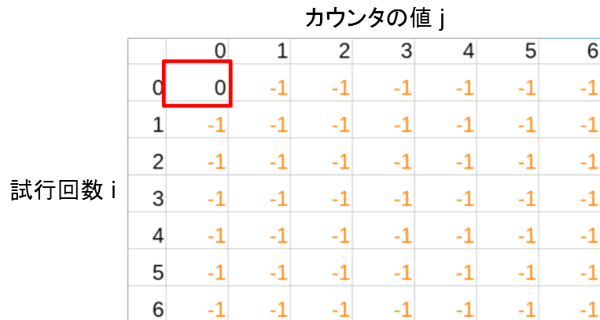

<!--
_color: white
_footer: 'Photo by https://www.pakutaso.com/'
-->

# アルゴリズムとデータ構造<br>第5章 動的計画法 <!-- omit in toc -->

---


# 目次 <!-- omit in toc -->
- [動的計画法とは？](#動的計画法とは)
- [例題：Flog問題(EDPC_A-Frog1)](#例題flog問題edpc_a-frog1)
- [緩和処理](#緩和処理)
- [配るDPと貰うDP](#配るdpと貰うdp)
- [例題：ABC261_D_Flipping and Bonus](#例題abc261_d_flipping-and-bonus)
- [例題：ナップサック問題](#例題ナップサック問題)
  - [動的計画法の部分問題の作り方](#動的計画法の部分問題の作り方)
  - [ナップサック問題に対する動的計画法](#ナップサック問題に対する動的計画法)
- [例題：編集距離を求める問題 (未)](#例題編集距離を求める問題-未)
- [まとめ](#まとめ)

---
# 動的計画法とは？

動的計画法（dynamic programming,DP）はアルゴリズム設計技法の一つです。

一言で言えば、**「与えられた問題全体を一連の部分問題に上手に分解し、各部分問題に対する解をメモ化しながら、小さな部分問題からより大きな部分問題へと順に解を求めていく手法」** です。

---

動的計画法は非常に汎用性の強い手法であり、コンピュータサイエンス上の重要な問題から、世の中のさまざまな現場における最適化問題まで、広範囲の問題を解くのに役立ちます！

- ナップサック問題
- スケジューリング問題
- 発電計画問題
- 編集距離を求める問題 (diff コマンドの仕組みです)
- 音声認識パターンマッチング問題
- 文章の分かち書きをする問題
- 隠れマルコフ問題
  
---

解決できる問題の幅が広い＝手法を適用するバリエーションが多彩で習得が難しい

ただ、設計パターン自体はそれほど多くないので、「習うより慣れろ！」精神で経験すれば習得できる。

・・・らしいです。

---

# [例題：Flog問題(EDPC_A-Frog1)](https://atcoder.jp/contests/dp/tasks/dp_a)


---

カエルは、ある足場にいるときに2通りの選択肢を選んでいく。
- 足場iからi+1へと移動する場合 (コスト|h_i-h_i+1|)
- 足場iからi+2へと移動する場合 (コスト|h_i-h_i+2|)
 
行動後のコストの最小値をメモするように残していく **(=最小化問題)**


なお、これは、足場を頂点、コストを辺の重みとすると、
「頂点1から頂点Nまで進む方法のうち、辿った辺の重みの総和の最小値を求める」
グラフ問題ととらえることもできます。

---
最小化問題のため、メモ用の1次元配列dp(N)は十分大きい数INFで初期化。
スタート地点dp[0]のコストを0とする。

```c++
// 初期化
vector<ll> dp(N,INF);
dp[0] = 0;
```


---
ある足場iにいるときに2通りの選択肢を選んでいく。
- 足場iからi+1へと移動する場合 (コスト|h_i-h_i+1|)
- 足場iからi+2へと移動する場合 (コスト|h_i-h_i+2|)
```c++
// 配るDP
rep(i,N-1){
    dp[i+1] = min(dp[i]+abs(h[i+1]-h[i]),dp[i+1]);           // i+1
    if(i+2<N) dp[i+2] = min(dp[i]+abs(h[i+2]-h[i]),dp[i+2]); // i+2
}
```


---
```c++
// 省略
using ll = long long;
#define rep(i, n) for (ll i = 0; i < (ll)(n); ++i)
int main(){
    int N;
    cin >> N;
    vector<int> h(N);
    rep(i,N) cin >> h[i];

    // 初期化
    vector<ll> dp(N,INF);
    dp[0] = 0;

    // 配るDP
    rep(i,N-1){
        dp[i+1] = min(dp[i]+abs(h[i+1]-h[i]),dp[i+1]);           // i+1
        if(i+2<N) dp[i+2] = min(dp[i]+abs(h[i+2]-h[i]),dp[i+2]); // i+2
    }
    cout << dp[N-1] << endl;
}
```
---
# 緩和処理
一般に、グラフ上で頂点uから頂点vへと遷移する辺があって、その遷移のコストをcとするとき、
```c++
dp[v]=min(dp[v],dp[u]+c);
chmin(dp[v],dp[u]+c);
```
とする処理を、その辺に関する緩和（relaxation）といいます。

緩和の処理のためにはテンプレート関数を使用すると便利。
```c++
template<class T> void chmax(T& a, T b) { if (a < b) a = b; }
template<class T> void chmin(T& a, T b) { if (a > b) a = b; }
```

---
# 配るDPと貰うDP
ある頂点iに着目すると、DPは2通りの考え方での実装ができる。

- 頂点iに向かって来る遷移を考える：貰う遷移方式
- 頂点iから伸びていく遷移を考える：配る遷移方式

---
Flog問題を貰うDPで記載した場合
```c++
// 貰うDP
for(int i=1;i<N;++i){
    dp[i] = min(dp[i-1]+abs(h[i]-h[i-1]),dp[i]);         // i+1
    if(i>1) dp[i] = min(dp[i-2]+abs(h[i]-h[i-2]),dp[i]); // i+2
}
```

Flog問題を配るDPで記載した場合
```c++
// 配るDP
for(int i=0;i<N-1;++i){
    dp[i+1] = min(dp[i]+abs(h[i+1]-h[i]),dp[i+1]);           // i+1
    if(i+2<N) dp[i+2] = min(dp[i]+abs(h[i+2]-h[i]),dp[i+2]); // i+2
}
```

---

# [例題：ABC261_D_Flipping and Bonus](https://atcoder.jp/contests/abc261/tasks/abc261_d)

高橋君が N 回コイントスを行います。 また、高橋君はカウンタを持っており、最初カウンタの数値は 0 です。 i 回目のコイントスで表裏のどちらが出たかによって、次のことが起こります。
- 表が出たとき：高橋君はカウンタの数値を 1 増やし、X_i円もらう。
- 裏が出たとき：高橋君はカウンタの数値を 0 に戻す。お金をもらうことは出来ない。

また、M 種類の連続ボーナスがあり、i 種類目の連続ボーナスではカウンタの数値が CiになるたびにYi円もらうことができます。
高橋君は最大で何円もらうことができるかを求めてください。

---
貰えるお金は試行回数とカウンタの数値で決まる。

「試行回数 i 回」*「カウンタ j」ような条件の下で 1 回目から i 回目までで得られる金額の最大値を更新していく。

---
メモ(2次元配列dp)を作成。
0回目、カウント0からスタートするため、[0][0]のみ初期値を入れ、ほかは外れ値を入れておく。

```c++
// 初期化
vector<vector<ll>> dp(N+1,vector<ll>(N+1,-1));
dp[0][0] = 0;
```



---
あるi,jに着目すると、裏になるパターンと表になるパターンの2通りの動作があることが分かる。
```c++
// 配るDP
rep(i,N){
    rep(j,N){
        if(dp[i][j]==-1) continue;
        // 表の場合
        dp[i+1][j+1] = dp[i][j]+X[i]+CY[j+1];
        // 裏の場合
        dp[i+1][0] = max(dp[i+1][0],dp[i][j]);
    }
}
```


---

入力例1
> 6 3
2 7 1 8 2 8
2 10
3 1
5 5

出力例1
> 48


---
```c++
// 省略
using ll = long long;
#define rep(i, n) for (ll i = 0; i < (ll)(n); ++i)

int main(){
    // 入力
    int N,M;
    cin >> N >> M;
    vector<int> X(N),CY(N+1,0);
    rep(i,N) cin >> X[i];
    rep(i,M){
        int c,y;
        cin >> c >> y;
        CY[c] = y;
    }    

    // 初期化
    vector<vector<ll>> dp(N+1,vector<ll>(N+1,-1));
    dp[0][0] = 0;
    
    // 配るDP
    rep(i,N){
        rep(j,N){
            if(dp[i][j]==-1) continue;            
            dp[i+1][j+1] = dp[i][j]+X[i]+CY[j+1];   // 表の場合
            dp[i+1][0]   = max(dp[i+1][0],dp[i][j]);// 裏の場合
        }
    }
    ll ans = -1;
    rep(j,N+1) ans = max(ans,dp[N][j]);
    cout << ans << endl;    
}
```
[iwasa提出コード](https://github.com/iwatadive28/ProgrammingContest/blob/main/ABC/ABC261/D.cpp)


---
# 例題：ナップサック問題

N個の品物があり、i(=0,1,...,N-1)番目の品物の重さはweight_i, 価値はvalue_iで与えられます。
このN個の品物から、重さの総和がWを超えないように、いくつか選びます。選んだ品物の価値として最大値を求めてください。ただし、Wやweight_iは整数とします。

---

## 動的計画法の部分問題の作り方
> N個の対象物{0,1,...,N-1}に関する問題に対して、最初のiこの対象物{0,1,...,i-1}に関する問題を部分問題として考えます。

「各段階において、いくつかの選択肢が存在する」
→ 動的計画法を有効に適用できそうだ！ということを示している。

今回は、あるi番目の品物を選ぶ場合、選ばない場合の2通りの問題として考えると、動的計画法が有効であると分かる。

---

## ナップサック問題に対する動的計画法
> dp[i][w]：最初のi個の品物{0,1,...,i-1}までの中から重さがwを超えないように選んだ時の、価値の総和の最大値。


---
```c++
// 省略
using ll = long long;
#define rep(i, n) for (ll i = 0; i < (ll)(n); ++i)
template<class T> void chmax(T& a, T b) { if (a < b) a = b; }
template<class T> void chmin(T& a, T b) { if (a > b) a = b; }

int main(){
    ll N,W;
    cin >> N >> W;
    vector<ll> w(N),v(N);
    rep(i,N)  cin >> w[i] >> v[i];
   
    // 初期化 
    vector<vector<ll>> dp(N+1,vector<ll>(W+1,0));
    
    // 配るDP
    rep(i,N){
        rep(j,W){
            // 品物を選ばない場合
            chmax(dp[i+1][j],dp[i][j]);
            // 品物を選ぶ場合
            if(j+w[i]<=W) chmax(dp[i+1][j+w[i]],dp[i][j]+v[i]);
        }        
    }
    cout << dp[N][W] << endl;
}
```
---

# 例題：編集距離を求める問題 (未)

資料間に合わず。本やアルゴ式、EDPCを参照ください。


---
# まとめ

複雑な問題をシンプルな部分問題に上手に分解することがポイントです。
設計手法に慣れましょう（自分に言い聞かせてます）！

- [典型的な DP (動的計画法) のパターンを整理](https://qiita.com/drken/items/a5e6fe22863b7992efdb)：この本の著者、けんちょんさんのQiita記事です。ここに本に記載されている内容がまとまってます。
- [アルゴ式](https://algo-method.com/courses/7)：けんちょんさんの管理する学習コンテンツ。
- [EDPC](https://atcoder.jp/contests/dp)：DPのコンテストです。第9回の輪講でみんなで気になる問題を持ち寄りましょう。
