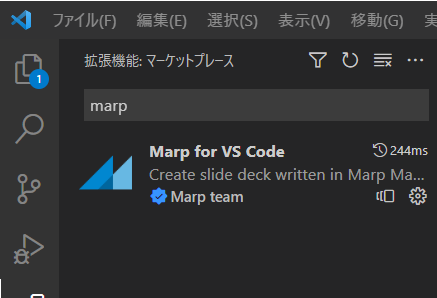

<!--
_color: white
_footer: 'Photo by https://www.pakutaso.com/'
-->

# アルゴリズムとデータ構造<br>Markdown -> スライド サンプル <!-- omit in toc -->


---


# 目次 <!-- omit in toc -->

- [概要](#概要)
- [インストール](#インストール)
- [コード](#コード)
- [インラインコード](#インラインコード)
- [数式](#数式)
- [表](#表)
- [画像の追加](#画像の追加)
- [Mermaid](#mermaid)
- [まとめ](#まとめ)

---
# 概要

* マークダウンからスライド作成
* VS Code + Marpを使用
* 参考：[Qiita Marp(Marpit)](https://qiita.com/takeshisakuma/items/5a61e6eac123d28602fb)
* 参考：[https://qiita.com/tomo_makes/items/aafae4021986553ae1d8](https://qiita.com/tomo_makes/items/aafae4021986553ae1d8)
    
---

# インストール
## Marp for VSCode <!-- omit in toc -->

VSCodeの場合プラグインをインストールする


※ すでにマークダウン用のプラグインもインストールしてる前提

---
# コード
ボリュームのあるコードは厳しそう。10行程度が限界。
```c++
int main(){
    ll N;
    cin >> N;
    vector<ll> a(N);
    rep(i,N) cin >> a[i];
    ll ax = 0;
    rep(i,N) ax^=a[i];
    rep(i,N){
        ll ans = ax ^ a[i];
        cout << ans << " ";    
    }
    cout << endl;
}
```
---
# インラインコード
これは `code` です

---
# 数式
```math
k_{n+1} = n^2 + k_n^2 - k_{n-1}
```
↓ こうなってほしかった


---

# 表
問題なく表示出来そう

| TH 左寄せ | TH 中央寄せ | TH 右寄せ |
| :--- | :---: | ---: |
| TD | TD | TD |
| TD | TD | TD |


---
# 画像の追加
右手に画像を追加する場合


---
# Mermaid
外部ツール（Kroki.io, Draw.io, Vega）の図表を読み込んで表示する方法。

ここでは、mermaidで図を生成する外部WEBサービスの[Kroki](https://kroki.io/)を使用する。

ローカル環境のVSCode上のmermaid用のプラグインで作成した図を使用する方法もあるかもしれない。


  
---
# まとめ

- マークダウンに慣れてる人は作りやすい。
- 1スライド1メッセージ型のスライドに向いている。
- 長いコードや複雑な数式には不向き。
- とにかく慣れ:smile:
